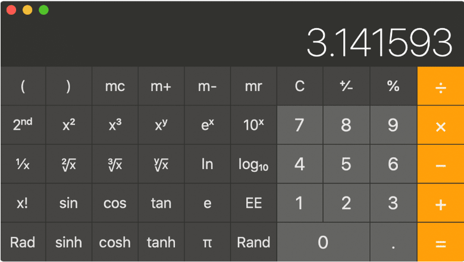

# Java Calculator Assignment
This is a replica of a scientific calculator app, made using the Java programming language along with the Swing and AWT library as part of the end of semester assignment.  

## Group Members:
 - Mohamed Junaid Chaudhry - 166335
 - Shadrack Mungai - 152522
 - Jimmy Kariuki Kimotho - 169767
 - Eric Musyimi Mutunga

## Guidlines Provided:
- [x] Functioning Elementary operations
- [x] Working Constants (e.g. 𝑃𝑖 and 𝑒)
- [x] Functioning Trigonometric operations (sin, cos, tan, sinh, cosh, tanh)
- [x] Working Logs and Powers
- [x] Working Inverse, Factorial, Roots and Modulo
- [x] GUI Look and Feel
- [x] Exception Handling
- [x] Demonstration of Abstraction (Interfaces & Abstract Classes), inheritence, polymorphism, and encapsulation

The project was aimed to look similar to the following UI as per instructions:

## Notes
- Nth roots are represented by `n√y`, for example the **forth** of **16** is given by `4√16 -> 2`.
- If multiplying by a root, for example **5** times the square root of **4** would have to be written as `5x2√4` rather than `5√4` as the later would evaluate to the fifth root of 4.

## Extra Features:
- History buffer, allows you to go back and see previous expressions.
- Shift button to show inverse operations.