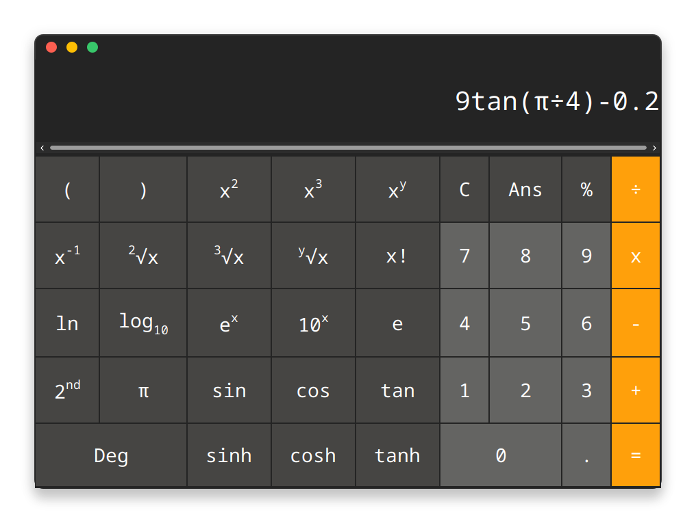

# Java Calculator Assignment
This is a replica of a scientific calculator app, made using the Java programming language along with the Swing and AWT library as part of the end of semester assignment.  

**Note:** This is a fork of the original group project with my own updates made after the deadline. The original project can be found here: [Java-Calculator](https://github.com/shady-mungai/Java-Calculator).

## Guidlines Provided:
- [x] Functioning Elementary operations
- [x] Working Constants (e.g. 𝑃𝑖 and 𝑒)
- [x] Functioning Trigonometric operations (sin, cos, tan, sinh, cosh, tanh)
- [x] Working Logs and Powers
- [x] Working Inverse, Factorial, Roots and Modulo
- [x] GUI Look and Feel
- [x] Exception Handling
- [x] Demonstration of Abstraction (Interfaces & Abstract Classes), inheritence, polymorphism, and encapsulation

The project was aimed to look similar to the following UI as per instructions:

The final app looks like this:

**Note:** The above was run in GNOME Linux with custom themeing set to change the window title bar buttons and positions. Do not expect it to look the exact same on your machine/system.

## Notes
- **Important:** This project will only run with Java 21 and above due to it's dependence on the ArrayList functions like `getLast()`.
- Nth roots are represented by `n√y`, for example the **forth** of **16** is given by `4√16 -> 2`.
- If multiplying by a root, for example **5** times the square root of **4** would have to be written as `5x2√4` rather than `5√4` as the later would evaluate to the fifth root of 4.
- **For MacOS** the button colors will not render due to Java and OpenGL being deprecated on Mac OSX and above, but the functions should work the same.

## Extra Features:
- History buffer, allows you to go back and see previous expressions.
- Shift button to show inverse operations.
- Hides scientific input buttons when window is resized to a smaller width automatically.
